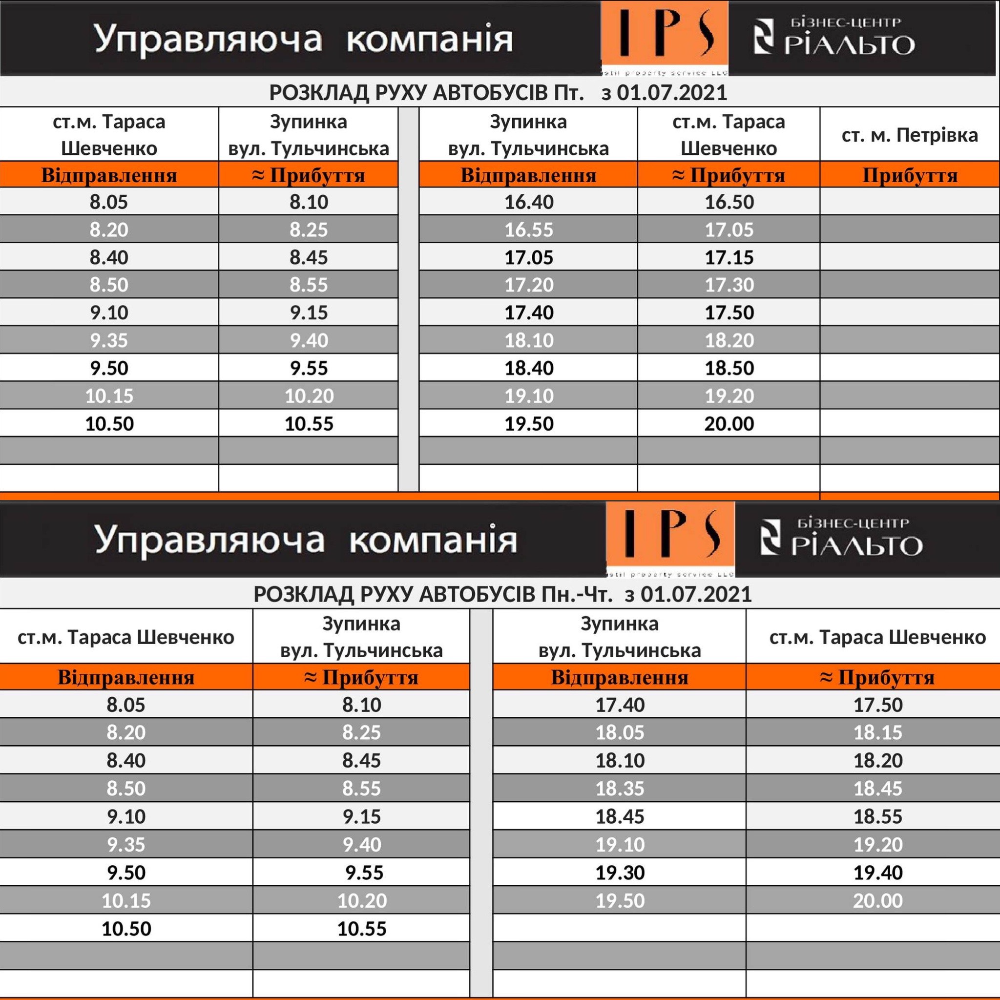

# Welcome to RialtoBusBot project!

This is a project for Python development with AWS CDK.

You can try it in Telegram - [@RialtoBusBot](https://t.me/RialtoBusBot).

Original schedule

---

## Useful cdk commands

 * `cdk ls`          list all stacks in the app
 * `cdk synth`       emits the synthesized CloudFormation template
 * `cdk deploy`      deploy this stack to your default AWS account/region
 * `cdk diff`        compare deployed stack with current state
 * `cdk docs`        open CDK documentation

To add additional dependencies, for example other CDK libraries, just add
them to your `setup.py` file and rerun the `pip install -r requirements.txt`
command.

---
Enjoy!
